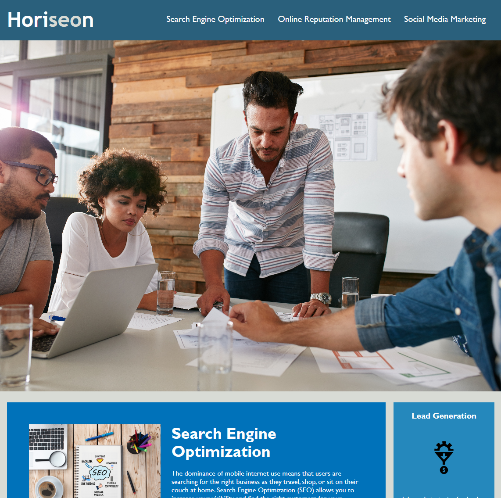

# <Module-1-accessibility-standards>

## Description

The goal of this project is to practice and gain knowledge of writing HTML with structured and semantic. 

- My motivation is to learn more about HTML and css.
- I built this project to improve my code writing skill. 
- By applying proper semantics to the HTML file, it is more organized and easily to identify problems. 
- I learned ways to structure HTML and css. 

## Usage

https://pandord24.github.io/Module-1-accessibility-standards/

By clicking the link provided, you can access the project hosted by github.

## Credits

Gordon Kwan
https://github.com/pandord24

